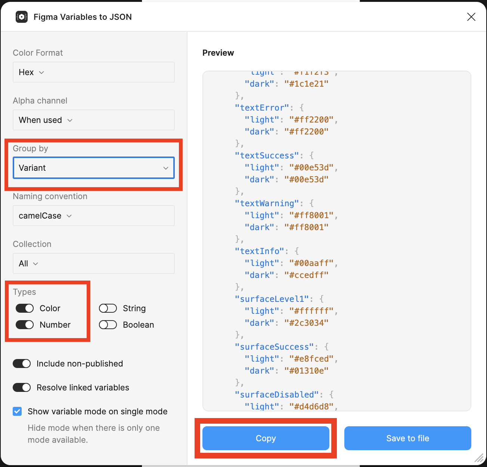

# Design Tokens

The export is done using the plugin named _`"Figma Variables to JSON"`_.

Steps to export:
1. Open [the Tokens-page in Figma](https://www.figma.com/design/iiPphTpUvJ3o51SkqIGwt1/00-Globeracer---Component-library---Phase-2.0?node-id=7509-280)
2. Ensure you have write access
3. Install [the plugin 'Figma Variables to JSON'](https://www.figma.com/community/plugin/1345399750040406570)
4. Run the plugin
5. Apply the settings as seen below
  - _Set "Group by" to "Variant"_
  - _Set "Types" to "Color" and "Number"_
6. Click the **COPY** button in the plugin view
   _(the plugin is bugged, so downloading the file results in an escaped JSON-file, which is rather useless)_
7. Overwrite the contents of 'tokens.json' with the contents of your clipboard
8. **[OPTIONAL]** If you're feeling particularly nice, run the script `format.sh` to make the contents of `tokens.json` readable by humans
   _(this requires `jq` to be installed)_
9. **[OPTIONAL]** If you have Xcode installed, run the script `convert`. If not, notify someone that can take it from there.
10. Commit & push
11. Notify the devs ❤️

